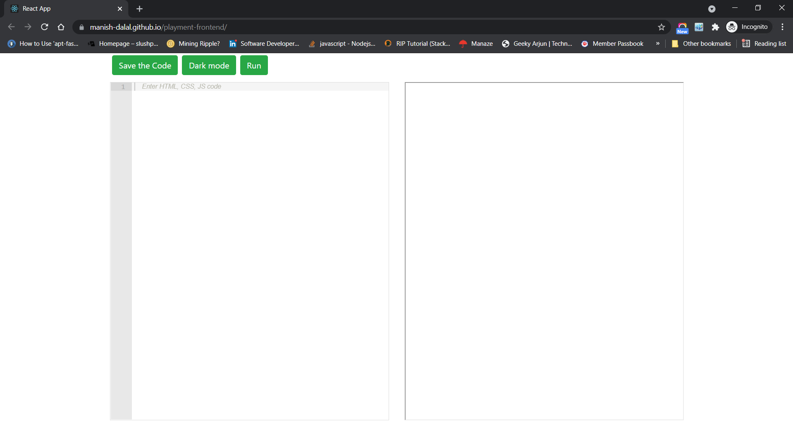

# Frontend Editor | Playment Frontend Developer Hiring Challenge

Develop a pseudo Front End Editor in React or Vue (Vanilla or Angular not allowed) which
would let the users code on the left and output the result on the right. This will be a
HTML, CSS, JS Editor

## How to run the project online

Open the online demo [here](https://manish-dalal.github.io/playment-frontend)

## Features

- Embed ACE Editor on the left part of the screen.
- Display an IFrame on the right part of the screen.
- Implement a Run button clicking which the HTML, CSS, JS code on the left (user submitted code in the Editor) gets executed a similar to a browser in
  the IFrame on the right.
- Implement proper error handling. There must be no frame distortion/mirroring.
- Responsive for Mobile Screens. Editor on top, IFrame on the bottom.
- A feature to Save the Code written in a file called ‘download.txt'.
- Implement a Dark Mode.

## GUIDE

- W3Schools Try it Editor - https://www.w3schools.com/tryit/tryit.asp?filename=tryhtml_default

  <b>Note</b>: Implement an Editor similar to this.

## How to run the project in Development Mode

The project uses [Node.js >= 6.x](https://nodejs.org/en/) and the [Create-React-App starter code](https://github.com/facebookincubator/create-react-app).

After Node is installed in your system, follow the below steps.

1. Navigate to the directory where you want to store the app.
2. Clone the repo `git clone https://github.com/manish-dalal/playment-frontend.git`
3. Now install all modules listed as dependencies in `package.json` by running the command `npm install`
4. Launch the app with this command `npm start`

A new browser window open automatically displaying the app. If it doesn't, navigate to [http://localhost:3000/](http://localhost:3000/) in your browser

**_NOTE:_** _The service workers for this app will only cache the site when it is in production mode._

## How to run the project in Production Mode

1. Build the production ready optimised code. `npm run build`
2. Deploy it to `gh-pages` branch by `npm run deploy`
3. Check the online demo [here](https://manish-dalal.github.io/playment-frontend)

## Screenshots

Project Home Page
</img>

Light mode
</img>

Dark mode
</img>
